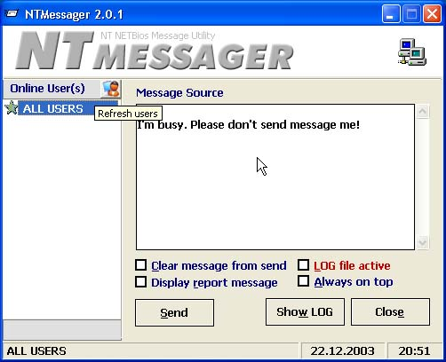



## NTMessager Network Message Utility

### Description

Must see. NTMessager is easy message sending system. This program working all 32Bit Microsoft Windows Sysytem and using NETBIOS. Very easy and power. MultiUSER message sending,SPY message traffic possibility,Easy effective tool...
 
### More Info
 

             |
---                |---
**Submitted On**   |2003-12-19 15:54:48
**By**             |[B\.Cem HANER](https://github.com/Planet-Source-Code/PSCIndex/blob/master/ByAuthor/b-cem-haner.md)
**Level**          |Advanced
**User Rating**    |5.0 (10 globes from 2 users)
**Compatibility**  |VB 5\.0, VB 6\.0, ASP \(Active Server Pages\) , VBA MS Access
**Category**       |[Coding Standards](https://github.com/Planet-Source-Code/PSCIndex/blob/master/ByCategory/coding-standards__1-43.md)
**World**          |[Visual Basic](https://github.com/Planet-Source-Code/PSCIndex/blob/master/ByWorld/visual-basic.md)
**Archive File**   |[NTMessager16879612302003\.zip](https://github.com/Planet-Source-Code/b-cem-haner-ntmessager-network-message-utility__1-50661/archive/master.zip)

